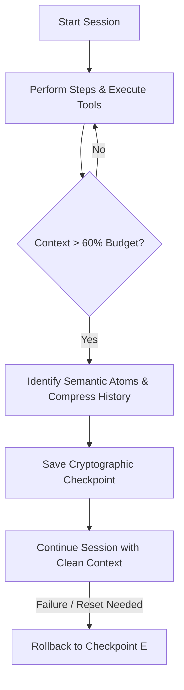

# Chronicle

Trajectory Compression & Checkpoint Memory. Chronicle keeps the agent's context window light and efficient during long-running sessions by dynamically pruning redundant execution histories and saving stable, tamper-evident checkpoints of system state and design rationale.

## Golden Rules
1. **Never drop semantic commitments**: Compress the raw transcript but never lose constraints, user-defined preferences, resolved bugs, or system design choices (semantic atoms).
2. **Tamper-Evident Checkpointing**: Checkpoints must be cryptographically hashed and linked to `keel`'s audit logs to prevent prompt injection from rewriting history.
3. **Dynamic Rollback**: Support Git-like revert capability to reset the agent session state to any previous checkpoint when a branch or implementation path fails.
4. **Token-Aware Summarization**: Trigger compression proactively when context size exceeds 50-60% of the target budget.

## Checkpointing and Rollback Flow


## Implementation Frameworks & Tooling
* **Session Control**: Inspired by `caveman-code`, manage agent execution state with discrete `/checkpoint` and `/rollback` commands.
* **Semantic Compression**: Leverage the concept of `Context Codec` to store "commitments" (decisions made) rather than generic text summarizations.
* **Redundancy Reduction**: Use local pre-processors (similar to `sqz` in Rust) to trim long command outputs, diffs, and logs to high-value snippets before they hit the context window.

## Usage Guide
Save checkpoints of the session during complex tasks:
```javascript
import { ChronicleMemory } from 'chronicle';

const chronicle = new ChronicleMemory();

// Save state before a risky refactoring step
await chronicle.checkpoint("Refactoring user authentication logic");

// If tests fail completely and context is polluted:
await chronicle.rollback(); // Restores context to the last checkpoint
```
